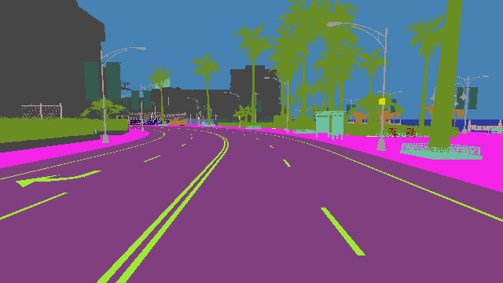
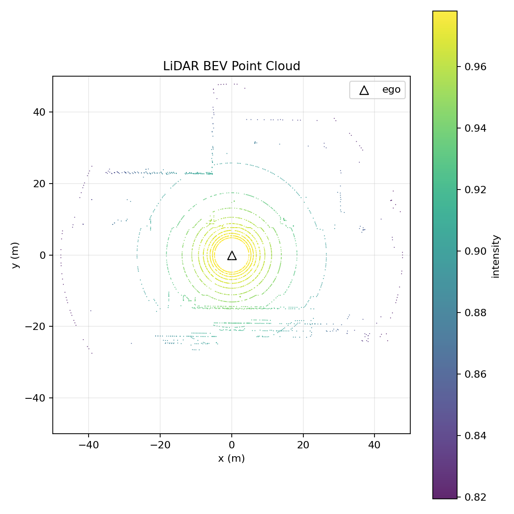
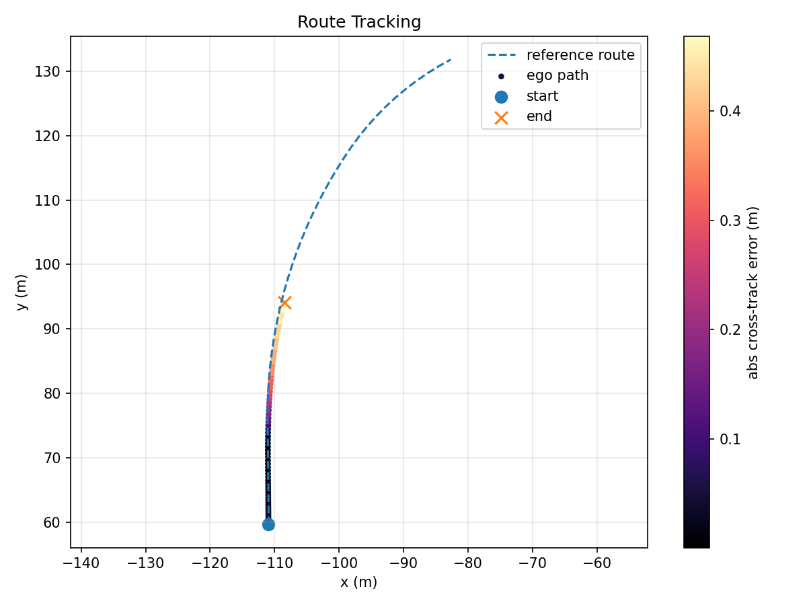

# CARLA 0.9.15 Ego Data Collection and Route Following Demo

A compact CARLA 0.9.15 project for ego vehicle simulation, multi-sensor data
collection, and fixed-route control. It demonstrates a practical Windows CARLA
server + WSL Python client workflow, including RGB camera output, semantic
segmentation, LiDAR point clouds, vehicle-state logging, Pure Pursuit lateral
control, PID speed control, and route-tracking visualization.

This is intended as a small but complete learning project for autonomous driving
simulation. The goal is not to provide a production autonomous driving stack,
but to make the full loop from simulation setup to sensor data, control commands,
metrics, and plots easy to inspect and reproduce.

## Project Overview

The demo follows a client-server architecture:

```text
Windows CARLA Server
        |
        v
WSL Python Client
        |
        v
Ego Vehicle in CARLA
        |
        +--> RGB camera frames
        +--> Semantic segmentation frames
        +--> LiDAR point clouds
        +--> Vehicle state CSV
        +--> Pure Pursuit + PID control
        |
        v
Trajectory plot + route tracking metrics
```

The main script, `run_demo.py`, can be used either as a simple data collection
tool with CARLA autopilot or as a basic route-following controller with explicit
speed, steering, throttle, and brake limits.

## Demo Output

Front RGB camera output:


Semantic segmentation output:



LiDAR bird's-eye-view point cloud:



Trajectory plot:


Route tracking plot for fixed-route control:



## What This Project Demonstrates

- CARLA Python client connection and simulator health checking.
- Ego vehicle spawning and cleanup.
- Synchronous simulation for deterministic frame-by-frame data collection.
- RGB, semantic segmentation, and LiDAR sensor attachment.
- Sensor data synchronization through Python queues.
- Vehicle pose, speed, and control-state logging.
- Fixed-route generation from CARLA waypoints.
- Pure Pursuit lateral control with steering-angle limits.
- PID speed control with target-speed, throttle, and brake limits.
- Route-tracking metric logging and visualization.

## Features

- Connect to a CARLA server from Python.
- Spawn one ego vehicle.
- Attach a front RGB camera to the ego vehicle.
- Optionally attach a semantic segmentation camera to the same pose.
- Optionally attach a roof-mounted LiDAR sensor.
- Run CARLA in synchronous mode.
- Save RGB frames to disk.
- Save semantic segmentation frames with the CityScapes color palette.
- Save LiDAR point clouds as PLY files.
- Save ego vehicle pose, velocity, and control states to CSV.
- Optionally follow a fixed route with Pure Pursuit lateral control.
- Optionally use PID speed control with throttle, brake, speed, and steering limits.
- Save route tracking metrics and a route tracking plot.
- Generate a trajectory plot after each run.
- Restore world settings and clean up actors after the script exits.

## Example Experiment

A typical route-following run uses the custom controller:

```bash
python run_demo.py \
  --host <your-carla-host> \
  --duration 60 \
  --fps 10 \
  --control-mode pure_pursuit \
  --target-speed 6 \
  --max-speed 8 \
  --max-steer-angle 30
```

The output includes:

```text
vehicle_state.csv       ego pose, velocity, and applied control
route_waypoints.csv     generated fixed route
tracking_metrics.csv    cross-track error, speed error, steering, throttle, brake
trajectory.png          ego vehicle trajectory
route_tracking.png      route versus actual driven path
config.json             command-line and experiment configuration
```

This makes the demo suitable for checking both whether the code runs and whether
the vehicle follows the intended route in a physically reasonable way.

## Tested Environment

- CARLA: 0.9.15
- CARLA server: Windows
- Python client: WSL Ubuntu
- Python: 3.10

Other environments may work if the CARLA Python package version matches the
CARLA server version.

## Project Structure

```text
carla_first_demo/
  assets/
    sample_rgb.png
    sample_lidar_bev.png
    sample_semantic.png
    sample_route_tracking.png
    sample_trajectory.png
  outputs/
    .gitkeep
  .gitignore
  LICENSE
  README.md
  requirements.txt
  run_demo.py
  smoke_test.py
  spawn_ego_demo.py
  tools/
    render_lidar_bev.py
```

## Quick Start

### 1. Start CARLA

Open PowerShell in your CARLA 0.9.15 folder and run:

```powershell
.\CarlaUE4.exe -windowed -ResX=1280 -ResY=720 -quality-level=Low
```

Keep the CARLA window open. If Windows Firewall asks for permission, allow
access on private networks.

### 2. Install Python Dependencies

Create or activate a Python 3.10 environment, then install:

```bash
python -m pip install -r requirements.txt
```

For example, with the local conda environment used during development:

```bash
~/miniconda3/envs/carla0915/bin/python -m pip install -r requirements.txt
```

### 3. Configure The CARLA Host

The CARLA host can be configured with `--host` or the `CARLA_HOST` environment
variable. This is useful for WSL, remote servers, and custom networking setups.

Recommended explicit usage:

```bash
python smoke_test.py --host <your-carla-host>
```

Environment variable usage:

```bash
export CARLA_HOST=<your-carla-host>
python smoke_test.py
```

Examples:

```bash
python smoke_test.py --host 127.0.0.1
python smoke_test.py --host 26.26.26.1
```

If CARLA runs on the same machine without WSL networking complications,
`127.0.0.1` may work. In WSL2, the Windows host IP depends on your local network
configuration, so passing `--host` explicitly is often the most reliable option.
The `26.26.26.1` address above is only an example from one development machine.

### 4. Run The Data Collection Demo

```bash
python run_demo.py --host <your-carla-host> --duration 60 --fps 10
```

Run with semantic segmentation output:

```bash
python run_demo.py --host <your-carla-host> --duration 60 --fps 10 --semantic
```

Run with RGB, semantic segmentation, and LiDAR output:

```bash
python run_demo.py --host <your-carla-host> --duration 60 --fps 10 --semantic --lidar
```

Run with fixed-route Pure Pursuit + PID control:

```bash
python run_demo.py \
  --host <your-carla-host> \
  --duration 60 \
  --fps 10 \
  --control-mode pure_pursuit \
  --target-speed 6 \
  --max-speed 8 \
  --max-steer-angle 30
```

Short smoke run:

```bash
python run_demo.py --host <your-carla-host> --duration 3 --fps 5 --width 640 --height 360 --semantic --lidar
```

Each run creates a timestamped output folder:

```text
outputs/
  run_YYYYMMDD_HHMMSS/
    rgb/
      000000.png
      000001.png
    semantic/
      000000.png
      000001.png
    lidar/
      000000.ply
      000001.ply
    vehicle_state.csv
    route_waypoints.csv
    tracking_metrics.csv
    trajectory.png
    route_tracking.png
    config.json
```

## Data Format

`vehicle_state.csv` contains one row per simulation frame:

```text
step, frame, timestamp, rgb_path, semantic_path, lidar_path,
x, y, z, roll, pitch, yaw,
vx, vy, vz, speed_mps,
throttle, steer, brake, hand_brake, reverse, gear
```

`tracking_metrics.csv` is created when `--control-mode pure_pursuit` is used:

```text
step, frame, timestamp, x, y,
nearest_index, target_index, route_progress_pct,
cross_track_error_m,
target_speed_mps, current_speed_mps, speed_error_mps,
steering_angle_deg, steer_cmd, throttle_cmd, brake_cmd
```

The RGB and semantic cameras are attached to the ego vehicle at a front
windshield-like pose:

```text
Location: x=1.6, z=1.7
Rotation: pitch=-5 deg
```

The LiDAR is mounted near the roof center:

```text
Location: x=0.0, z=2.4
Default channels: 32
Default points per second: 56000
Default range: 50 m
```

The Pure Pursuit controller applies explicit physical limits:

```text
steer_cmd: [-1, 1]
max steering angle: configurable, default 35 deg
target speed: capped by --max-speed
throttle: [0, --max-throttle]
brake: [0, --max-brake]
```

## Learning Notes

This project is designed around a staged learning path:

1. `smoke_test.py`: verify the Python client can connect to CARLA.
2. `spawn_ego_demo.py`: spawn one ego vehicle and observe CARLA autopilot.
3. `run_demo.py --semantic --lidar`: collect synchronized multi-sensor data.
4. `run_demo.py --control-mode pure_pursuit`: run a custom route-following
   baseline and evaluate tracking errors.

Key concepts covered by the code:

- CARLA client-server workflow.
- Python command-line interfaces with `argparse`.
- Simulation timing and synchronous mode.
- Sensor callbacks and queue-based frame collection.
- Basic vehicle kinematics concepts such as speed, yaw, cross-track error, and
  steering angle.
- Controller parameter tuning through repeated simulation.

## Scripts

`smoke_test.py`

Minimal connection test. Run this first when debugging networking or CARLA
startup issues.

`spawn_ego_demo.py`

Legacy minimal ego vehicle demo. It spawns one vehicle, enables CARLA autopilot,
and follows it with the spectator camera.

`run_demo.py`

Main data collection script. It uses synchronous mode, spawns an ego vehicle,
attaches a front RGB camera, optionally attaches a semantic segmentation camera,
optionally attaches a LiDAR sensor, saves sensor frames and vehicle states, and
generates trajectory and route tracking plots.

`tools/render_lidar_bev.py`

Utility script for rendering an ASCII PLY LiDAR frame as a static bird's-eye
view PNG for quick inspection or README figures.

Example:

```bash
python tools/render_lidar_bev.py outputs/run_YYYYMMDD_HHMMSS/lidar/000000.ply assets/sample_lidar_bev.png --limit 50
```

## Troubleshooting

`ModuleNotFoundError: No module named 'carla'`

Install the matching CARLA Python package in the Python environment that runs
the script:

```bash
python -m pip install carla==0.9.15
```

`RuntimeError: time-out while waiting for the simulator`

Check that CARLA is running, the map has finished loading, Windows Firewall is
not blocking the server, and `--host` points to the correct machine.

`Connection refused`

CARLA is probably not listening on port `2000`, or the server process is not
running. Start `CarlaUE4.exe` again and retry `smoke_test.py`.

Images are not saved

Make sure `run_demo.py` is used instead of `spawn_ego_demo.py`. The legacy demo
only shows a spectator view and does not attach a sensor.

LiDAR files are not saved

Make sure `--lidar` is passed to `run_demo.py`. LiDAR point clouds are saved as
`.ply` files in the `lidar/` output folder.

LiDAR is hard to inspect in GitHub

GitHub does not render `.ply` point clouds interactively in README files. Use
`tools/render_lidar_bev.py` to create a static BEV PNG for documentation or
quick visual checks.

Vehicle does not follow the route

Use `--control-mode pure_pursuit` to enable the custom controller. The default
mode is `autopilot`, which uses CARLA's Traffic Manager instead of the fixed
route controller.

## Current Limitations

- The fixed route is generated from CARLA map waypoints, not from a full global
  planner.
- The controller is a baseline Pure Pursuit + PID implementation, not MPC or an
  optimization-based controller.
- RGB, semantic, and LiDAR data are collected and saved, but they are not yet
  used for closed-loop perception or decision making.
- The demo currently focuses on one ego vehicle instead of dense traffic
  scenarios.
- The sample figures are static README assets; full experiment outputs are saved
  under `outputs/` and are ignored by Git.

## Roadmap

- Add a small result report generator.
- Add route selection presets.
- Add controller comparison between autopilot, Pure Pursuit, and future MPC.
- Add a short project brief for sharing the project with lab members or
  collaborators.

## License

This project is released under the MIT License. See [LICENSE](LICENSE).
