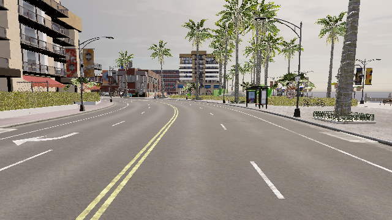
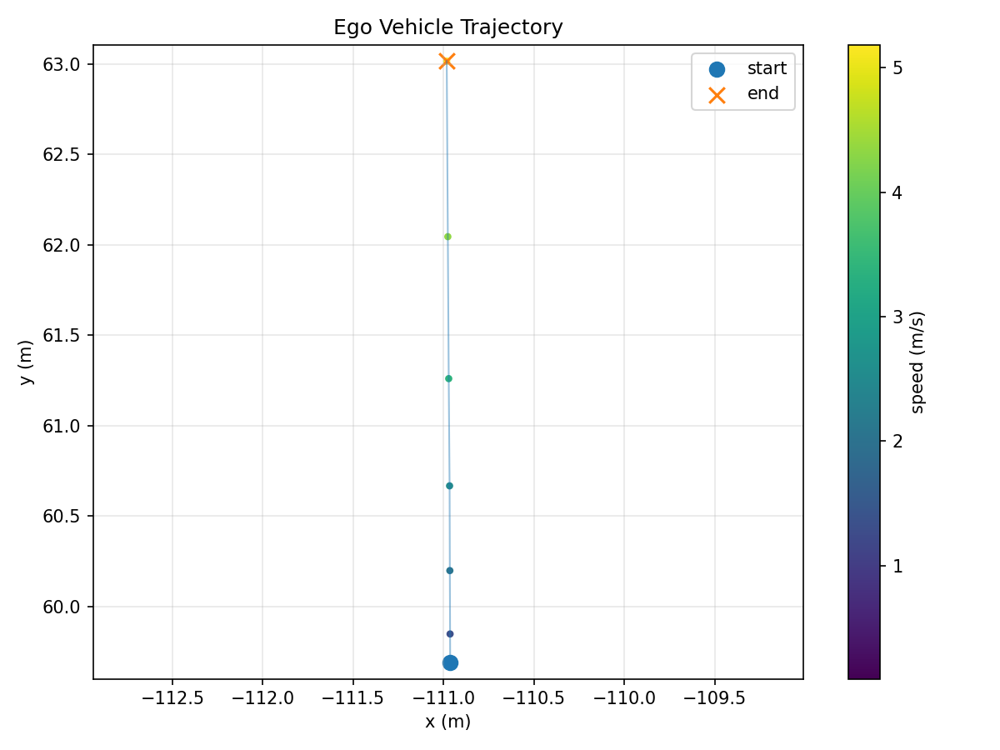

# CARLA 0.9.15 Ego Vehicle Data Collection Demo

A compact CARLA 0.9.15 demo for collecting front RGB images, ego vehicle
states, and a trajectory plot from a Python client. The project is designed for
the common setup where CARLA runs on Windows and the Python client runs in WSL,
but the host can be configured for other networking setups.

## Demo Output

Front RGB camera:



Trajectory plot:



## Features

- Connect to a CARLA server from Python.
- Spawn one ego vehicle.
- Attach a front RGB camera to the ego vehicle.
- Run CARLA in synchronous mode.
- Save RGB frames to disk.
- Save ego vehicle pose, velocity, and control states to CSV.
- Generate a trajectory plot after each run.
- Restore world settings and clean up actors after the script exits.

## Tested Environment

- CARLA: 0.9.15
- CARLA server: Windows
- Python client: WSL Ubuntu
- Python: 3.10

Other environments may work if the CARLA Python package version matches the
CARLA server version.

## Project Structure

```text
carla_first_demo/
  assets/
    sample_rgb.png
    sample_trajectory.png
  outputs/
    .gitkeep
  .gitignore
  LICENSE
  README.md
  requirements.txt
  run_demo.py
  smoke_test.py
  spawn_ego_demo.py
```

## Quick Start

### 1. Start CARLA

Open PowerShell in your CARLA 0.9.15 folder and run:

```powershell
.\CarlaUE4.exe -windowed -ResX=1280 -ResY=720 -quality-level=Low
```

Keep the CARLA window open. If Windows Firewall asks for permission, allow
access on private networks.

### 2. Install Python Dependencies

Create or activate a Python 3.10 environment, then install:

```bash
python -m pip install -r requirements.txt
```

For example, with the local conda environment used during development:

```bash
~/miniconda3/envs/carla0915/bin/python -m pip install -r requirements.txt
```

### 3. Configure The CARLA Host

The CARLA host can be configured with `--host` or the `CARLA_HOST` environment
variable. This is useful for WSL, remote servers, and custom networking setups.

Recommended explicit usage:

```bash
python smoke_test.py --host <your-carla-host>
```

Environment variable usage:

```bash
export CARLA_HOST=<your-carla-host>
python smoke_test.py
```

Examples:

```bash
python smoke_test.py --host 127.0.0.1
python smoke_test.py --host 26.26.26.1
```

If CARLA runs on the same machine without WSL networking complications,
`127.0.0.1` may work. In WSL2, the Windows host IP depends on your local network
configuration, so passing `--host` explicitly is often the most reliable option.
The `26.26.26.1` address above is only an example from one development machine.

### 4. Run The Data Collection Demo

```bash
python run_demo.py --host <your-carla-host> --duration 60 --fps 10
```

Short smoke run:

```bash
python run_demo.py --host <your-carla-host> --duration 3 --fps 5 --width 640 --height 360
```

Each run creates a timestamped output folder:

```text
outputs/
  run_YYYYMMDD_HHMMSS/
    rgb/
      000000.png
      000001.png
    vehicle_state.csv
    trajectory.png
    config.json
```

## Data Format

`vehicle_state.csv` contains one row per simulation frame:

```text
step, frame, timestamp, image_path,
x, y, z, roll, pitch, yaw,
vx, vy, vz, speed_mps,
throttle, steer, brake, hand_brake, reverse, gear
```

The RGB camera is attached to the ego vehicle at a front windshield-like pose:

```text
Location: x=1.6, z=1.7
Rotation: pitch=-5 deg
```

## Scripts

`smoke_test.py`

Minimal connection test. Run this first when debugging networking or CARLA
startup issues.

`spawn_ego_demo.py`

Legacy minimal ego vehicle demo. It spawns one vehicle, enables CARLA autopilot,
and follows it with the spectator camera.

`run_demo.py`

Main data collection script. It uses synchronous mode, spawns an ego vehicle,
attaches a front RGB camera, saves RGB frames and vehicle states, and generates
a trajectory plot.

## Troubleshooting

`ModuleNotFoundError: No module named 'carla'`

Install the matching CARLA Python package in the Python environment that runs
the script:

```bash
python -m pip install carla==0.9.15
```

`RuntimeError: time-out while waiting for the simulator`

Check that CARLA is running, the map has finished loading, Windows Firewall is
not blocking the server, and `--host` points to the correct machine.

`Connection refused`

CARLA is probably not listening on port `2000`, or the server process is not
running. Start `CarlaUE4.exe` again and retry `smoke_test.py`.

Images are not saved

Make sure `run_demo.py` is used instead of `spawn_ego_demo.py`. The legacy demo
only shows a spectator view and does not attach a sensor.

## Roadmap

- Add semantic segmentation camera output.
- Add LiDAR output.
- Add fixed route generation.
- Replace CARLA autopilot with PID or Pure Pursuit control.
- Add trajectory tracking error metrics.
- Add a small result report generator.

## License

This project is released under the MIT License. See [LICENSE](LICENSE).
